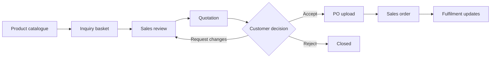
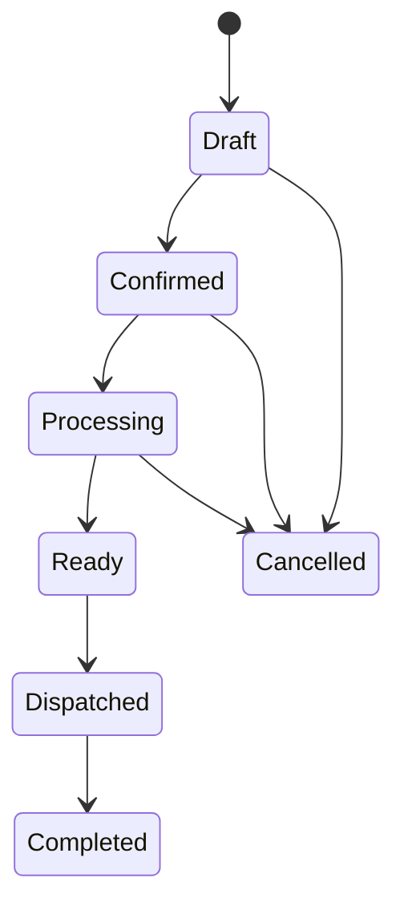
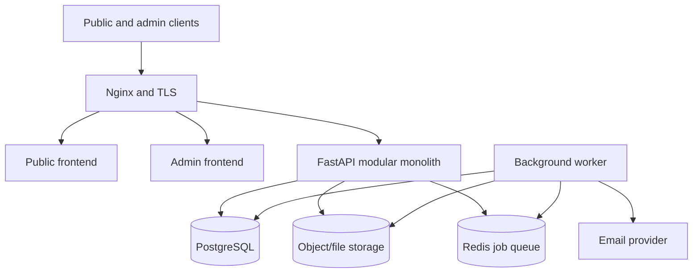

# Uni-Green B2B Website and Sales Portal

## Implementation Blueprint

**Status:** Proposed baseline  
**Date:** 2026-07-27  
**Target:** Production MVP on the existing family-company VPS  
**Primary business:** Tissue and toilet-paper manufacturing and B2B sales  
**Delivery model:** Backend and infrastructure developed contract-first; frontend developed by Claude against the published OpenAPI contract

---

## 1. Executive decision

Uni-Green v1 will be a **B2B catalogue and quotation-to-order platform**, not a general e-commerce store and not yet an ERP.

The production workflow is:



The website must solve five real business problems:

1. Present Uni-Green professionally to domestic and international buyers.
2. Collect structured inquiries instead of relying on informal chat messages.
3. Let sales staff prepare consistent, versioned quotations.
4. Receive customer purchase orders and preserve the complete document trail.
5. Notify the correct people and show the current status of every opportunity.

### Architectural position

- Uni-Green is a separate application from HASC.
- It receives its own database, secrets, containers, storage namespace, deployment pipeline, and backups.
- It may reuse proven patterns and generic packages from HASC, but not HASC business tables or database connections.
- ERP integration is a later boundary. Uni-Green v1 should expose stable IDs and APIs that can be integrated without a rewrite.
- Start as a modular monolith. Do not introduce microservices or Kubernetes.

---

## 2. Product scope

### 2.1 MVP in scope

#### Public website

- Responsive homepage
- Company and manufacturing profile
- Product catalogue with categories, search, and filters
- Product details and technical specifications
- Inquiry basket containing multiple products
- Structured inquiry form
- OEM/private-label requirement field
- Contact page
- Vietnamese and English content
- SEO metadata, sitemap, robots file, and social previews
- Privacy notice and inquiry consent

#### Customer-facing sales flow

- Submit inquiry without creating an account
- Email verification or signed inquiry confirmation link
- Inquiry reference number
- Secure quotation link
- Quotation PDF download
- Accept, reject, or request changes
- Upload a customer-issued PO
- Receive email confirmation
- Secure order-status link

#### Staff portal

- Staff login and role-based authorization
- Dashboard showing new inquiries and pending actions
- Inquiry search, filters, detail view, assignment, and internal notes
- Customer/company records
- Product, category, specification, and image management
- Quotation builder
- Quotation versioning
- PDF generation
- Email send/resend and delivery history
- PO upload and review
- Conversion to internal sales order
- Order status updates
- Document download
- Audit trail
- CSV export for inquiries, quotations, and orders

#### Platform operations

- PostgreSQL persistence
- Object/file storage abstraction
- Background jobs for PDFs and email
- Database migrations
- Structured logs and request IDs
- Health and readiness endpoints
- Automated backups with tested restoration
- CI checks and controlled production deployment

### 2.2 Explicitly out of scope for MVP

- Online payment
- Public shopping-cart checkout
- Automatic shipping calculation
- Courier integration
- Real-time inventory reservation
- Accounting ledger
- Tax invoice issuance
- Supplier purchasing
- Manufacturing planning
- Bill of materials
- Warehouse stock movements
- Distributor portal with negotiated price lists
- Native mobile application
- AI chatbot
- Microservices

These belong to later sales-platform or ERP releases.

---

## 3. Users and permissions

| Actor | Capabilities |
|---|---|
| Visitor | Browse products, change language, build inquiry, submit inquiry |
| Customer contact | Open signed links, review quotation, accept/reject/request changes, upload PO, view order status |
| Sales staff | Manage assigned inquiries, customers, quotations, emails, POs, and sales orders |
| Sales manager | All sales functions, reassign records, approve quotations, export reports |
| Content editor | Manage public pages, products, specifications, and media; no commercial access |
| Administrator | Manage staff accounts, roles, configuration, audit access, and operational settings |

### Authorization rules

- All commercial and administrative authorization is enforced by the backend.
- Hiding a button in the frontend is not authorization.
- Customer links use short-lived or revocable signed tokens, never predictable database IDs.
- Sensitive downloads require authorization on every request.
- Staff permissions follow least privilege.
- Every commercial status change creates an audit event.

---

## 4. Business rules

### 4.1 Inquiry

- An inquiry contains one or more product lines.
- Quantity and unit are required for each line.
- A customer may request a standard product, OEM/private-label production, or both.
- Submission generates a human-readable reference such as `UG-INQ-2026-000123`.
- Duplicate submission protection uses an idempotency key.
- Staff may mark spam, duplicate, qualified, quoted, won, or lost.
- The original customer submission remains immutable; staff corrections are stored separately.

### 4.2 Quotation

- A quotation belongs to one inquiry and one customer company.
- It has one or more versions.
- Only an approved version may be sent.
- Sending a newer version supersedes the older active version.
- Price, tax, discount, delivery cost, currency, validity date, Incoterm/delivery term, and payment term are quotation snapshots.
- Product name and specification are copied into each quotation line so later catalogue edits do not alter historical documents.
- Totals are calculated with decimal arithmetic, never floating point.
- PDF content must match the stored quotation snapshot.
- Acceptance after expiry requires staff review.

### 4.3 Purchase order

- The formal PO is normally issued by the customer.
- The platform stores the customer PO number and original uploaded document.
- Accepted formats in v1: PDF, PNG, JPG, and optionally DOCX after security review.
- Files are MIME-sniffed, size-limited, renamed internally, and never executed.
- A PO upload does not silently alter quotation prices or quantities.
- Any discrepancy between PO and quotation must be reviewed by sales staff.

### 4.4 Sales order

- A sales order is created only from an accepted quotation and reviewed PO, unless a manager records an approved exception.
- Sales-order identifiers follow a separate sequence such as `UG-SO-2026-000045`.
- Sales orders preserve commercial snapshots.
- MVP statuses:



### 4.5 Email

- Business state is committed before an email job is queued.
- Failed email delivery never rolls back the inquiry, quotation, PO, or order.
- Each outbound email has a template version, recipient list, related entity, provider ID, attempts, and final status.
- Staff can safely retry failed messages.
- Customer email addresses are never exposed to other customers.

---

## 5. Functional requirements

### Public and catalogue

| ID | Requirement | Priority |
|---|---|---|
| PUB-01 | Visitors can view a responsive public site without authentication. | Must |
| PUB-02 | Visitors can switch between Vietnamese and English. | Must |
| CAT-01 | Visitors can browse active product categories and products. | Must |
| CAT-02 | Product pages show images, packaging, ply, dimensions, material, roll count, SKU, and configurable specifications. | Must |
| CAT-03 | Staff can publish, unpublish, reorder, and edit catalogue content. | Must |
| CAT-04 | URLs and metadata are SEO-friendly. | Should |

### Inquiry and CRM

| ID | Requirement | Priority |
|---|---|---|
| INQ-01 | Visitors can add multiple products and quantities to an inquiry basket. | Must |
| INQ-02 | The form captures contact, company, tax code, address, destination, notes, and OEM requirements. | Must |
| INQ-03 | Submission is validated, rate-limited, idempotent, and acknowledged by email. | Must |
| INQ-04 | Staff can assign, tag, search, filter, and add internal notes. | Must |
| INQ-05 | Staff can convert an inquiry into a quotation without retyping line items. | Must |

### Quotation

| ID | Requirement | Priority |
|---|---|---|
| QUO-01 | Authorized staff can create and revise quotation drafts. | Must |
| QUO-02 | The backend calculates subtotal, discount, tax, shipping, and total. | Must |
| QUO-03 | Managers can approve quotations when approval is required. | Must |
| QUO-04 | The platform generates a versioned PDF and sends a secure link. | Must |
| QUO-05 | Customers can accept, reject, or request changes. | Must |
| QUO-06 | Every sent version and customer decision is auditable. | Must |

### PO and order

| ID | Requirement | Priority |
|---|---|---|
| PO-01 | An authorized customer link can upload a PO for an accepted quotation. | Must |
| PO-02 | The backend validates and stores the file safely. | Must |
| PO-03 | Staff can review, accept, or flag PO discrepancies. | Must |
| ORD-01 | Staff can convert an eligible quotation and PO into a sales order. | Must |
| ORD-02 | Staff can update order status and notify the customer. | Must |
| ORD-03 | Customers can view a limited order timeline through a signed link. | Should |

### Administration

| ID | Requirement | Priority |
|---|---|---|
| ADM-01 | Staff authenticate securely and receive role-based permissions. | Must |
| ADM-02 | Administrators can invite, disable, and change roles for staff. | Must |
| ADM-03 | Sensitive actions and changes are recorded in an audit trail. | Must |
| ADM-04 | Staff can export operational records as CSV. | Should |

---

## 6. Non-functional requirements

| Area | Target |
|---|---|
| Availability | Suitable for low-to-moderate SME traffic on one VPS; graceful background-job recovery |
| Performance | Public cached pages target LCP under 2.5 s on normal Vietnamese mobile connectivity; API p95 under 500 ms excluding file/PDF work |
| Accessibility | WCAG 2.1 AA for primary public and staff workflows |
| Browser support | Current and previous major versions of Chrome, Edge, Firefox, and Safari |
| Localization | No user-visible business text hard-coded into backend responses where translation is needed |
| Security | OWASP-aligned validation, authorization, file handling, secrets, rate limits, and auditability |
| Privacy | Collect only sales-relevant personal data; documented retention and deletion procedure |
| Recovery | Daily backups at minimum; defined RPO of 24 hours and initial RTO of 4 hours |
| Observability | Structured logs, request IDs, error tracking, uptime monitoring, job visibility |
| Maintainability | Typed contracts, migrations, modular boundaries, automated checks, documented runbooks |

---

## 7. Proposed architecture



### 7.1 Backend modules

```text
app/
  auth/
  staff/
  customers/
  catalogue/
  inquiries/
  quotations/
  purchase_orders/
  sales_orders/
  documents/
  notifications/
  audit/
  content/
  shared/
```

Rules:

- Modules own their tables and domain behavior.
- Cross-module access occurs through explicit service interfaces.
- API routers do not contain business rules.
- Database models are not returned directly to clients.
- Background jobs receive entity IDs, not entire mutable payloads.
- External providers are behind adapters.

### 7.2 Deployment topology on the existing VPS

Use a separate directory and Compose project, for example `/srv/unigreen`.

Recommended containers:

- `unigreen-nginx`
- `unigreen-public`
- `unigreen-admin`
- `unigreen-backend`
- `unigreen-worker`
- `unigreen-redis`
- `unigreen-db`
- `unigreen-migrate` as a one-shot deployment job

Use separate:

- Docker network
- PostgreSQL database and user
- `.env`/secret set
- upload/storage prefix
- named volumes
- backup directory
- domain configuration

Do not duplicate Umami if one properly isolated instance can serve both companies. Give each site its own Umami website ID and access policy.

### 7.3 Storage strategy

Define a storage interface from the beginning:

```text
put(stream, key, content_type)
get_signed_url(key, expiry)
delete(key)
exists(key)
```

The first deployment may use a mounted volume if necessary, but the application must not depend on local filesystem paths. This allows later migration to S3-compatible storage.

---

## 8. Technology stack

### Backend and data

| Concern | Choice | Reason |
|---|---|---|
| API | Python 3.12 + FastAPI | Existing expertise, typed OpenAPI, suitable modular backend |
| Validation | Pydantic v2 | Request, response, settings, and domain boundary validation |
| ORM | SQLAlchemy 2.x | Explicit transaction control and mature PostgreSQL support |
| Migrations | Alembic | Reviewable, deterministic schema evolution |
| Database | PostgreSQL 16 | Relational integrity, transactions, reporting, JSONB where justified |
| Queue | Redis + Dramatiq or Celery | Reliable email/PDF work outside HTTP requests |
| PDF | HTML/CSS template rendered server-side | Consistent quotation and order documents |
| Email | Provider adapter | Prevent lock-in; initial provider chosen in Sprint 0 |
| Auth | Secure cookie session or short-lived access token plus rotating refresh token | Staff authentication with revocation support |
| Tests | Pytest, pytest-asyncio, HTTPX, Testcontainers | Unit, API, database, and integration coverage |

### Frontend owned by Claude

Preferred baseline:

- Next.js with TypeScript
- Tailwind CSS
- Accessible component primitives
- TanStack Query for server state
- React Hook Form plus Zod for form UX validation
- Generated API types/client from the backend OpenAPI document
- Playwright for browser tests
- Vitest and Testing Library for component tests
- `next-intl` or equivalent for Vietnamese/English

Frontend validation improves UX; the backend remains authoritative.

### Infrastructure

- Docker and Docker Compose
- Nginx
- Let's Encrypt/Certbot with verified renewal
- GitHub Actions
- GitHub Container Registry
- Immutable image tags using commit SHA
- VPS deployment through a least-privilege deployment user
- Encrypted off-server backups

---

## 9. Core data model

| Entity | Important fields |
|---|---|
| StaffUser | id, email, password_hash/auth_subject, status, last_login_at |
| Role / Permission | role, permission, scope |
| CustomerCompany | id, legal_name, tax_code, addresses, country, notes |
| CustomerContact | id, company_id, name, email, phone, position |
| ProductCategory | id, parent_id, localized name, slug, status, sort_order |
| Product | id, sku, localized name/description, status, OEM flag |
| ProductSpecification | product_id, key, localized label, value, unit, sort_order |
| ProductMedia | product_id, storage_key, alt text, sort_order |
| Inquiry | id, reference, company/contact snapshot, status, source, assigned_to |
| InquiryLine | inquiry_id, product_id, product snapshot, quantity, unit, requirements |
| InternalNote | entity_type, entity_id, author_id, body, created_at |
| Quotation | id, reference, inquiry_id, company_id, current_version, status |
| QuotationVersion | quotation_id, version, currency, terms, validity, totals, approval |
| QuotationLine | version_id, product_id, snapshots, quantity, unit_price, discount, tax |
| CustomerDecision | version_id, decision, comment, token_id, decided_at |
| PurchaseOrder | id, quotation_id, customer_po_number, storage_key, review_status |
| SalesOrder | id, reference, quotation_version_id, purchase_order_id, status, totals |
| SalesOrderLine | sales_order_id, immutable commercial snapshots |
| Document | owner_type, owner_id, type, version, storage_key, checksum, MIME, size |
| EmailDelivery | template, recipients, entity, provider_id, status, attempts |
| AuditEvent | actor, action, entity_type, entity_id, before/after summary, request_id |
| PublicContent | key, locale, title, body, status, version |

### Data conventions

- Primary keys: UUIDv7 or UUID4 internally.
- Public references: separate human-readable sequences.
- Monetary values: `NUMERIC`, explicit currency, defined rounding.
- Timestamps: UTC in database; render in the relevant business timezone.
- Soft deletion only where history is legally or operationally important.
- Uploaded documents have checksums and immutable storage keys.
- Optimistic version fields protect commercial records from lost updates.

---

## 10. API contract

Base path: `/api/v1`

### Public endpoints

```text
GET    /public/site
GET    /public/categories
GET    /public/products
GET    /public/products/{slug}
POST   /public/inquiries
POST   /public/inquiries/{reference}/verify
GET    /customer/quotations/{token}
POST   /customer/quotations/{token}/decision
POST   /customer/quotations/{token}/purchase-order
GET    /customer/orders/{token}
```

### Staff endpoints

```text
POST   /auth/login
POST   /auth/refresh
POST   /auth/logout
GET    /auth/me

GET    /staff/inquiries
GET    /staff/inquiries/{id}
PATCH  /staff/inquiries/{id}
POST   /staff/inquiries/{id}/assign
POST   /staff/inquiries/{id}/notes

POST   /staff/quotations
GET    /staff/quotations/{id}
POST   /staff/quotations/{id}/versions
POST   /staff/quotations/{id}/approve
POST   /staff/quotations/{id}/send

POST   /staff/purchase-orders/{id}/review
POST   /staff/sales-orders
PATCH  /staff/sales-orders/{id}/status

GET    /staff/customers
POST   /staff/customers
PATCH  /staff/customers/{id}

GET    /staff/products
POST   /staff/products
PATCH  /staff/products/{id}
POST   /staff/products/{id}/media

GET    /staff/audit-events
GET    /staff/exports/{resource}
```

### Contract rules for Claude

- Backend publishes `openapi.json` as a CI artifact.
- Frontend generates TypeScript types/client; types are not manually duplicated.
- Every endpoint defines success and error responses.
- Standard error envelope:

```json
{
  "error": {
    "code": "QUOTATION_EXPIRED",
    "message": "This quotation has expired.",
    "field_errors": {},
    "request_id": "..."
  }
}
```

- Pagination, sorting, filtering, date, decimal, and enum conventions are documented once.
- Breaking API changes require a versioned migration or coordinated pull requests.
- Mock Service Worker may use examples derived from OpenAPI until backend endpoints are ready.

---

## 11. Security baseline

### Authentication and sessions

- Passwords use Argon2id if local password authentication is used.
- Secure, HttpOnly, SameSite cookies are preferred for same-site staff applications.
- CSRF protection is required for cookie-authenticated mutations.
- Login and reset endpoints are rate-limited.
- Staff sessions can be revoked.
- Administrators cannot retrieve passwords.
- Initial administrator creation occurs through a one-time deployment command, not a public endpoint.

### API and data

- Validate all inputs on the backend.
- Use allowlisted sort/filter fields.
- Enforce object-level authorization.
- Parameterize all database queries.
- Escape/sanitize rich content according to its rendering context.
- Apply CORS only to explicit production origins.
- Do not put sensitive customer or pricing information in logs.
- Secrets exist only in deployment secret configuration.

### Uploads

- Limit file size and count.
- Verify extension, reported MIME, and detected MIME.
- Store outside the web root.
- Generate storage names server-side.
- Use authorized/signed downloads.
- Strip unsafe image metadata when appropriate.
- Add malware scanning when operationally feasible; until then, restrict accepted formats conservatively.

### Operational

- Run containers as non-root where practical.
- Do not expose PostgreSQL or Redis publicly.
- Limit SSH access and use keys.
- Use a firewall allowing only required ports.
- Rotate production secrets after accidental exposure.
- Review dependencies and container images automatically.

---

## 12. Testing strategy

### 12.1 Test pyramid

| Layer | Scope | Owner |
|---|---|---|
| Unit | Pricing, tax, state transitions, permissions, token rules, file validation | Backend/Codex |
| Repository | SQL constraints, queries, migrations, concurrency | Backend/Codex |
| API integration | HTTP contract against real PostgreSQL and Redis | Backend/Codex |
| Contract | OpenAPI validity and generated frontend-client compatibility | Shared |
| Component | Forms, tables, loading/error states, accessibility | Frontend/Claude |
| End-to-end | Visitor inquiry through staff quotation and customer PO | Shared |
| Security | Authorization matrix, rate limits, upload abuse, dependency/container scans | Backend/DevOps |
| Operational | Backup restore, migration, rollback, TLS renewal, worker recovery | DevOps |

### 12.2 Mandatory business test scenarios

1. Visitor submits a multi-product inquiry and receives one reference.
2. Retried submission with the same idempotency key does not create a duplicate.
3. Unauthorized staff cannot view commercial records.
4. Sales staff converts an inquiry to a quotation without losing line details.
5. All quotation totals and rounding are correct.
6. An approved quotation produces a PDF matching stored values.
7. A superseded quotation version cannot be accepted.
8. An expired quotation is blocked or routed for review.
9. A customer cannot access another customer's quotation by changing a URL.
10. Invalid or oversized PO files are rejected.
11. A valid PO is stored, checksummed, and visible only to authorized users.
12. Duplicate PO submission is handled safely.
13. A sales order cannot be created from an unaccepted quotation.
14. Concurrent quotation edits do not silently overwrite each other.
15. Email-provider failure preserves business data and produces a retryable job.
16. Worker restart resumes or safely retries pending work.
17. Database migration succeeds from the previous production schema.
18. Backup restoration produces a usable system with document references intact.

### 12.3 Quality gates

Initial targets:

- Backend line coverage: 80% overall, 90% for pricing and state-transition modules.
- No unreviewed critical/high dependency vulnerabilities.
- No failing type checks, lint, migration, unit, integration, contract, or build jobs.
- Playwright smoke tests pass against a production-like Compose environment.
- Accessibility scan has no serious/critical issue in core flows.
- A deployment cannot proceed if the migration dry run or health checks fail.

Coverage is a guardrail, not a substitute for meaningful assertions.

---

## 13. CI/CD

### 13.1 Pull-request CI

Run changed-path-aware jobs in parallel:

#### Backend

- Ruff lint and formatting check
- Mypy or Pyright type check
- Pytest unit tests
- PostgreSQL/Redis integration tests
- Alembic migration consistency and upgrade test
- OpenAPI generation and diff
- Dependency vulnerability scan
- Docker image build

#### Frontend

- ESLint
- Prettier check
- TypeScript check
- Unit/component tests
- Production build
- Accessibility smoke test
- Generated client matches committed/published OpenAPI contract

#### Full stack

- Start production-like Docker Compose
- Apply migrations
- Seed deterministic test data
- Run Playwright critical-path tests
- Run container/image scan

### 13.2 Main-branch build

- Require protected `main`.
- Require pull request review and successful CI.
- Build immutable backend, worker, public, and admin images.
- Tag images with commit SHA.
- Push to GHCR.
- Produce release notes and deployment manifest.
- Never build mutable production code directly on the VPS.

### 13.3 Production deployment

Use a controlled/manual production approval initially:

1. Verify release manifest.
2. Create database and document-storage backup.
3. Pull exact commit-SHA images.
4. Run migration job.
5. Start/recreate application services.
6. Check readiness, worker, database, Redis, and critical HTTP routes.
7. Run production smoke test.
8. Record deployment result.
9. Roll back application images if unhealthy.

Database rollback is not assumed to be automatically safe. Migrations should use expand/contract patterns when destructive changes are necessary.

### 13.4 Environments

| Environment | Purpose |
|---|---|
| Local | Docker Compose development and generated fixtures |
| CI | Ephemeral integration and browser testing |
| Staging | Production-like acceptance, email sandbox, migration verification |
| Production | Real customer and commercial data |

Staging must not send messages to real customers.

---

## 14. Observability and operations

### Application

- JSON structured logs
- Request/correlation ID propagated into jobs
- Actor and entity IDs where safe
- Central error tracking
- Metrics for request rate, errors, latency, job backlog, job failures, email outcomes, and storage failures

### Health endpoints

```text
GET /health/live
GET /health/ready
```

- Liveness shows that the process is running.
- Readiness verifies required dependencies within a strict timeout.
- Readiness must not mutate data.

### Alerts

- Website unavailable
- API error-rate threshold exceeded
- Database/volume space low
- Backup missing or failed
- Redis unavailable or job backlog excessive
- Repeated email failures
- TLS certificate approaching expiry

### Runbooks

- Deploy
- Roll back
- Restore database and documents
- Rotate secrets
- Recover worker queue
- Renew TLS
- Disable compromised staff account
- Handle failed email/PDF generation

---

## 15. Sprint plan

Assumption: one-week sprints with a potentially releasable increment. If the team works part-time, retain the scope and extend the calendar rather than compressing acceptance criteria.

### Sprint 0 — Discovery and engineering foundation

**Goal:** Remove business ambiguity and establish contracts.

Backend/architecture:

- Confirm legal company information, currencies, VAT behavior, quotation terms, approval rule, PO review process, supported languages, email sender, and domain plan.
- Create repository structure and engineering decision records.
- Define domain enums, state transitions, reference formats, and initial ERD.
- Create FastAPI skeleton, settings, database, Alembic, Redis, worker, health endpoints, and local Compose.
- Publish initial OpenAPI conventions and error envelope.

Claude/frontend:

- Create design direction, sitemap, information architecture, design tokens, and responsive shell.
- Build API-independent component catalogue.
- Prepare bilingual content key structure.

DevOps/testing:

- Configure protected branches, PR template, issue templates, CI skeleton, secret scanning, linting, and test containers.
- Define staging and production configuration inventory.

**Exit criteria:** Both sides can develop locally; OpenAPI conventions and architecture decisions are approved.

### Sprint 1 — Catalogue and content

**Goal:** Deliver a usable bilingual public catalogue.

Backend:

- Product categories, products, localized fields, specifications, and media.
- Admin catalogue endpoints and public read endpoints.
- Secure image-upload pipeline.
- Seed initial Uni-Green products.

Claude/frontend:

- Homepage, catalogue, filters, product detail, company page, contact page.
- Admin product/category CRUD.
- Responsive and accessibility baseline.

Tests:

- Catalogue API, authorization, upload validation, SEO metadata, responsive browser smoke tests.

**Exit criteria:** Staff can publish products; visitors can browse them in Vietnamese and English.

### Sprint 2 — Inquiry and customer records

**Goal:** Replace informal product inquiries with structured records.

Backend:

- Inquiry basket submission API.
- Customer company/contact records.
- Reference generation, idempotency, rate limiting, assignment, notes, and status.
- Inquiry acknowledgement email job.

Claude/frontend:

- Inquiry basket and multi-step form.
- Confirmation state.
- Admin inquiry list, filters, detail, assignment, notes, and customer panels.

Tests:

- Validation, spam/rate-limit behavior, idempotency, permissions, email failure/retry, end-to-end inquiry path.

**Exit criteria:** A real visitor can submit an inquiry and staff can process it from the portal.

### Sprint 3 — Quotation engine

**Goal:** Generate controlled commercial quotations from inquiries.

Backend:

- Quotation and immutable version schema.
- Decimal pricing/tax/discount calculations.
- Approval workflow.
- PDF generation and document storage.
- Signed customer quotation links.
- Send/resend and delivery tracking.

Claude/frontend:

- Quotation builder with line editing and totals preview.
- Approval and version-history screens.
- Customer quotation page.
- Accept, reject, and request-change actions.

Tests:

- Calculation matrix, version rules, expiry, authorization, PDF snapshot, email delivery, customer decision E2E.

**Exit criteria:** Staff can send a quotation and receive a traceable customer decision.

### Sprint 4 — PO and sales order

**Goal:** Complete quotation-to-order conversion.

Backend:

- Secure customer PO upload.
- PO review and discrepancy status.
- Sales-order creation and status transitions.
- Customer order-status token.
- Order notifications.

Claude/frontend:

- Customer PO upload.
- Staff PO review.
- Sales-order detail and status controls.
- Customer order timeline.

Tests:

- File security, token isolation, eligibility rules, concurrency, transition matrix, full inquiry-to-order E2E.

**Exit criteria:** An accepted quotation can produce a reviewed PO and internal sales order.

### Sprint 5 — Hardening and operational readiness

**Goal:** Make the complete system safe to operate.

- Role and permission audit
- Security review and abuse tests
- Accessibility pass
- Performance profiling and caching
- SEO validation
- Backup automation and restore drill
- TLS renewal validation
- Log, metric, alert, and runbook completion
- Migration rehearsal on a production-like data copy
- Browser/device acceptance testing
- Vietnamese and English content review

**Exit criteria:** All production-readiness checklist items pass; recovery is demonstrated, not assumed.

### Sprint 6 — Launch and stabilization

**Goal:** Release safely and learn from real usage.

- Import final products and content
- Create production staff accounts and roles
- Configure verified email domain
- Deploy exact release images
- Run smoke tests
- Submit sample inquiry and complete an internal quotation/PO rehearsal
- Monitor logs, email delivery, performance, and user behavior
- Fix only launch blockers and high-impact usability problems
- Create prioritized post-MVP backlog

**Exit criteria:** Uni-Green staff can independently operate the complete workflow with documented recovery support.

---

## 16. Collaboration model: Codex/backend and Claude/frontend

### Source-of-truth order

1. Business rules and acceptance criteria
2. OpenAPI contract and domain enums
3. Backend behavior and tests
4. Generated frontend client
5. Frontend screens

### Ownership

| Area | Primary owner | Required coordination |
|---|---|---|
| Architecture, database, API, security | Codex/backend | Publish ADRs and OpenAPI |
| Public/admin UX and frontend implementation | Claude | Consume generated types; report contract gaps |
| Business requirements and acceptance | Product owner | Resolve commercial decisions |
| E2E scenarios | Shared | One agreed fixture set and selectors |
| CI/CD and VPS operations | Backend/DevOps | Frontend images included in release manifest |

### Branch and worktree policy

- No two agents edit the same files concurrently.
- Backend and frontend use separate directories and preferably separate worktrees/branches.
- Contract changes land before or together with consuming frontend changes.
- Generated API clients are regenerated in CI.
- UI mock data must match OpenAPI examples.
- Each sprint has one integration branch only if necessary; prefer small PRs into protected `main`.
- Do not let either agent perform unrelated formatting or repository-wide rewrites.

### Definition of ready for a frontend story

- User and business outcome is stated.
- API endpoint/schema exists or is approved.
- Loading, empty, error, permission, and success states are specified.
- Responsive behavior and accessibility expectations are stated.
- Acceptance test is written.

---

## 17. Definition of done

A story is done only when:

- Acceptance criteria pass.
- Backend authorization is implemented.
- Required unit/integration/component tests pass.
- OpenAPI and generated client agree.
- Loading, empty, error, and retry states are handled.
- Audit behavior is present where required.
- Localization keys exist for Vietnamese and English.
- Logs contain enough context without leaking sensitive data.
- Migrations are reviewed and reversible or safely forward-correctable.
- Documentation and operational notes are updated.
- CI is green.
- The feature works in the production-like Compose environment.

---

## 18. Decisions required during Sprint 0

These are not blockers to architecture planning, but they must be decided before commercial implementation:

1. Official company name, address, tax code, bank/payment text, hotline, sales email, and logo assets.
2. Production domain and subdomains.
3. Whether quotations require manager approval and above what value.
4. Supported currencies and VAT rules.
5. Standard payment, delivery, and quotation-validity terms.
6. Whether anonymous signed links are acceptable or customer accounts are required later.
7. PO discrepancy approval responsibility.
8. Maximum PO/document file size and allowed formats.
9. Initial staff roles and named operational owners.
10. Email provider and verified sending domain.
11. Required retention period for inquiries, quotations, POs, orders, and audit events.
12. Whether local-volume storage is acceptable for launch or S3-compatible storage is required immediately.

---

## 19. Post-MVP path toward ERP

Do not implement these during the Uni-Green MVP. Preserve integration points for:

- Shared customer master across family companies
- Central staff identity and permissions
- Distributor pricing
- Inventory and warehouse movements
- Supplier purchasing
- Manufacturing batches and bills of materials
- Delivery management
- Receivables/payment status
- Accounting integration
- Group-level reporting

The trigger for extracting an ERP service is repeated, validated business behavior across Uni-Green and HASC—not merely similar table names.

