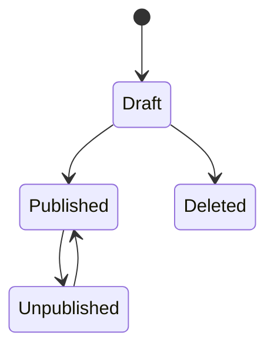
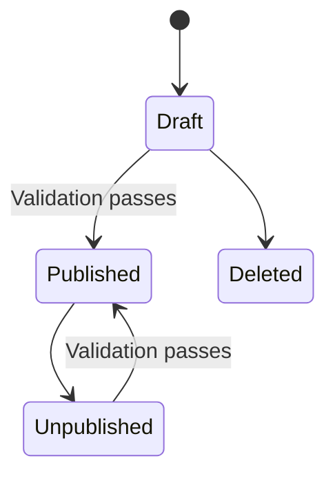

# Uni-Green Sprint 1 — Bilingual Catalogue and Content Administration

**Sprint:** 1  
**Status:** Ready for execution after preflight decisions  
**Target duration:** 1 focused working week, or 2 calendar weeks if part-time  
**Date prepared:** 2026-07-27  
**Repository:** `https://github.com/lystiger/Unigreen`  
**Backend owner:** Codex/backend  
**Frontend owner:** Claude  
**Product owner:** Nguyen Duc Anh / Uni-Green representative

---

## 1. Sprint outcome

At the end of Sprint 1:

1. Uni-Green staff can sign in securely.
2. Authorized staff can create, edit, publish, unpublish, reorder, and add media to product categories and products.
3. Visitors can browse published products in Vietnamese and English.
4. Product pages display verified specifications and optimized product images.
5. The public frontend consumes the real API rather than the temporary static catalogue.
6. CI verifies migrations, contracts, authorization, frontend behavior, and production image builds.

This sprint establishes the first real business domain in the application: **catalogue and public content**.


---

## 2. Sprint boundaries

### In scope

- Sprint 0 infrastructure corrections
- Minimal staff authentication required for catalogue administration
- Catalogue role authorization
- Product categories
- Products
- Vietnamese and English product content
- Flexible product specifications
- Product media upload and processing
- Public category/product APIs
- Staff category/product/media APIs
- Catalogue page
- Product detail page
- Search, category filtering, and pagination
- Admin catalogue screens
- Initial verified product seed/import
- Catalogue unit, integration, contract, component, and E2E tests
- CI path and full-stack validation improvements

### Explicitly out of scope

- Inquiry basket
- Inquiry form
- Customers and CRM
- Email notifications
- Quotations
- Pricing
- Customer accounts
- Purchase-order upload
- Sales orders
- Inventory quantities
- Warehouses
- Online payment
- Distributor price lists
- Production planning
- Rich-text page builder
- General ERP functionality

No inquiry, quotation, PO, or ERP table should be added during Sprint 1.

---

## 3. Sprint 0 carry-over preflight

These items are part of Sprint 1 and must be completed before catalogue features are merged.

### P0-01 — Verify public business content

Create an approved content sheet containing:

- Official legal company name
- Public trading name
- Address
- Tax code if it will be displayed
- Public sales email
- Hotline
- Website/domain
- Certifications that may legally be shown
- OEM capability statement
- Standard customer-response claim
- Product SKUs and official display names
- Confirmed product specifications
- Confirmed MOQ values
- Confirmed packs per carton
- Confirmed container quantities, if they will be public

Rules:

- Unverified numbers remain internal and must not be rendered publicly.
- Do not publish placeholder telephone numbers, addresses, certifications, MOQs, or delivery promises.
- Current values in `frontend/lib/catalogue.ts` are reference data, not approved production data.
- Claims such as “sample in seven days” require explicit business approval.

### P0-02 — Lock the Sprint 1 storage decision

Sprint 1 uses:

- A mounted VPS volume behind a backend `Storage` interface.
- Storage keys, never absolute local paths, in the database.
- Authorized backend delivery for original files.
- Public optimized variants exposed through controlled URLs.
- A future S3-compatible adapter without schema changes.

Accepted product-image input:

- JPEG
- PNG
- WebP

Rejected:

- SVG
- GIF
- TIFF
- PDF as a product image
- Files whose detected MIME type does not match the allowlist

Initial limits:

- Maximum upload size: 10 MiB
- Maximum decoded image area: 24 megapixels
- Maximum five media items per product for Sprint 1
- Strip metadata during processing
- Generate WebP variants at widths 480, 960, and 1600 pixels
- Preserve aspect ratio
- Do not upscale smaller images

### P0-03 — Make backend Docker builds deterministic

Required changes:

- Replace fallback dependency installation with `uv sync --frozen --no-dev`.
- Add `backend/.dockerignore`.
- Exclude `.venv`, `.env`, caches, coverage, tests, build outputs, and local artifacts.
- Confirm the backend image still builds in CI.

### P0-04 — Close CI path gaps

Changes to these files must trigger appropriate CI:

- `compose.yaml`
- `.env.example`
- backend/frontend Dockerfiles
- migration configuration
- shared contracts
- workflow definitions

Add an infrastructure validation job that:

1. Runs `docker compose config`.
2. Builds the backend, worker, and web images.
3. Starts PostgreSQL and Redis.
4. Applies Alembic migrations.
5. Starts the API.
6. Verifies `/health/live` and `/health/ready`.

### P0-05 — Protect integration

Before concurrent Sprint 1 merges:

- Protect `main`.
- Require pull requests.
- Require current backend and frontend CI checks.
- Prevent force pushes to `main`.
- Enable secret scanning where available.
- Add automated dependency-update configuration or create a tracked follow-up.

---

## 4. Sprint architecture decisions

### 4.1 One backend modular monolith

Add these modules:

```text
backend/src/unigreen/
  auth/
  staff/
  catalogue/
  media/
  storage/
```

Responsibilities:

- `auth`: staff login, logout, current session, password verification
- `staff`: staff users, roles, bootstrap administrator
- `catalogue`: categories, products, translations, specifications, publication rules
- `media`: upload validation, image processing, media metadata
- `storage`: filesystem interface and implementation

Catalogue routers must not contain business rules.

### 4.2 One Next.js application during Sprint 1

Keep the existing `frontend/` application.

- Public routes remain under `/vi` and `/en`.
- Staff routes use `/admin`.
- Local development uses one frontend process.
- The API remains the security boundary.
- A later deployment may expose staff routes through `admin.<domain>` without changing the backend contract.

Do not split the frontend repository during this sprint.

### 4.3 Minimal staff authentication

Sprint 1 requires authentication because admin catalogue endpoints must never be anonymous.

Use:

- Staff email and Argon2id password hash
- Server-created opaque session identifier
- Session record stored in PostgreSQL or Redis with revocation support
- Secure, HttpOnly, SameSite cookie
- CSRF protection for cookie-authenticated mutations
- Rate limiting on login
- One-time CLI command to create the initial administrator

Sprint 1 roles:

| Role | Catalogue read | Catalogue write | Publish | Staff management |
|---|---:|---:|---:|---:|
| Content editor | Yes | Yes | Yes | No |
| Administrator | Yes | Yes | Yes | Later |
| Sales staff | Yes | No | No | No |
| Sales manager | Yes | No | No | No |

Invitations, password reset by email, MFA, and general staff-management UI are later work.

### 4.4 Publication behavior

- Draft products are visible only to authorized staff.
- Published products appear through public endpoints.
- Unpublished products disappear from catalogue listings and return public `404`.
- A product cannot be published without:
  - Vietnamese name and summary
  - English name and summary
  - SKU
  - Stable slug
  - At least one category
  - At least one specification
  - At least one primary media item, unless a manager-approved launch exception is recorded
- Publication and unpublication are audited.

---

## 5. User stories

| ID | Story | Priority | Owner |
|---|---|---|---|
| S1-01 | As staff, I can sign in and obtain only my permitted catalogue capabilities. | Must | Backend + Claude |
| S1-02 | As a content editor, I can manage product categories in Vietnamese and English. | Must | Backend + Claude |
| S1-03 | As a content editor, I can create and edit bilingual product drafts. | Must | Backend + Claude |
| S1-04 | As a content editor, I can add ordered technical specifications to a product. | Must | Backend + Claude |
| S1-05 | As a content editor, I can upload, reorder, describe, and remove product images safely. | Must | Backend + Claude |
| S1-06 | As a content editor, I can publish or unpublish a valid product. | Must | Backend + Claude |
| S1-07 | As a visitor, I can browse published products by locale and category. | Must | Backend + Claude |
| S1-08 | As a visitor, I can search published products by name, SKU, and summary. | Must | Backend + Claude |
| S1-09 | As a visitor, I can view a product with specifications and optimized images. | Must | Backend + Claude |
| S1-10 | As an operator, I can run and recover the catalogue stack using documented commands. | Must | Backend/DevOps |

---

## 6. Data model

Use UUID primary keys, UTC timestamps, and explicit uniqueness and foreign-key constraints.

### 6.1 `staff_users`

| Column | Type | Rules |
|---|---|---|
| `id` | UUID | Primary key |
| `email` | CITEXT or normalized VARCHAR | Unique, lowercase-normalized |
| `password_hash` | TEXT | Argon2id |
| `role` | enum/string | Existing `StaffRole` values |
| `status` | enum/string | `active`, `disabled` |
| `last_login_at` | timestamp | Nullable |
| `created_at` | timestamp | Required |
| `updated_at` | timestamp | Required |
| `version` | integer | Optimistic locking |

### 6.2 `staff_sessions`

| Column | Type | Rules |
|---|---|---|
| `id` | UUID | Primary key; never sent directly if a hashed token design is used |
| `staff_user_id` | UUID | Foreign key |
| `token_hash` | TEXT | Unique |
| `expires_at` | timestamp | Required |
| `revoked_at` | timestamp | Nullable |
| `created_at` | timestamp | Required |
| `last_seen_at` | timestamp | Nullable |
| `ip_hash` | TEXT | Optional; do not retain raw IP without purpose |
| `user_agent_summary` | TEXT | Optional and length-limited |

### 6.3 `product_categories`

| Column | Type | Rules |
|---|---|---|
| `id` | UUID | Primary key |
| `slug` | VARCHAR | Unique, lowercase, immutable after publication unless explicitly migrated |
| `status` | publication enum | Draft/published/unpublished |
| `parent_id` | UUID | Nullable self-reference |
| `sort_order` | integer | Non-negative |
| `created_at` | timestamp | Required |
| `updated_at` | timestamp | Required |
| `version` | integer | Optimistic locking |

### 6.4 `product_category_translations`

| Column | Type | Rules |
|---|---|---|
| `category_id` | UUID | Foreign key |
| `locale` | locale enum | `vi` or `en` |
| `name` | VARCHAR | Required |
| `description` | TEXT | Optional |
| `meta_title` | VARCHAR | Optional |
| `meta_description` | VARCHAR | Optional |

Unique key: `(category_id, locale)`.

### 6.5 `products`

| Column | Type | Rules |
|---|---|---|
| `id` | UUID | Primary key |
| `sku` | VARCHAR | Unique, normalized |
| `slug` | VARCHAR | Unique public identifier |
| `barcode` | VARCHAR | Nullable; unique when present |
| `status` | publication enum | Draft/published/unpublished |
| `oem_available` | boolean | Required |
| `featured` | boolean | Required |
| `sort_order` | integer | Non-negative |
| `published_at` | timestamp | Nullable |
| `created_at` | timestamp | Required |
| `updated_at` | timestamp | Required |
| `version` | integer | Optimistic locking |

Do not add public price, inventory, or cost columns.

### 6.6 `product_translations`

| Column | Type | Rules |
|---|---|---|
| `product_id` | UUID | Foreign key |
| `locale` | locale enum | `vi` or `en` |
| `name` | VARCHAR | Required |
| `summary` | TEXT | Required for publication |
| `description` | TEXT | Optional |
| `meta_title` | VARCHAR | Optional |
| `meta_description` | VARCHAR | Optional |

Unique key: `(product_id, locale)`.

### 6.7 `product_category_links`

| Column | Type | Rules |
|---|---|---|
| `product_id` | UUID | Foreign key |
| `category_id` | UUID | Foreign key |
| `sort_order` | integer | Non-negative |

Unique key: `(product_id, category_id)`.

### 6.8 `product_specifications`

| Column | Type | Rules |
|---|---|---|
| `id` | UUID | Primary key |
| `product_id` | UUID | Foreign key |
| `key` | VARCHAR | Machine-readable key such as `basis_weight` |
| `value` | VARCHAR | Display-neutral value |
| `unit` | VARCHAR | Nullable, such as `g/m²`, `mm`, `m` |
| `sort_order` | integer | Non-negative |
| `is_highlighted` | boolean | Show in specification strip |

Unique key: `(product_id, key)`.

### 6.9 `product_specification_translations`

| Column | Type | Rules |
|---|---|---|
| `specification_id` | UUID | Foreign key |
| `locale` | locale enum | `vi` or `en` |
| `label` | VARCHAR | Required |
| `display_value_override` | VARCHAR | Optional |

Unique key: `(specification_id, locale)`.

### 6.10 `product_media`

| Column | Type | Rules |
|---|---|---|
| `id` | UUID | Primary key |
| `product_id` | UUID | Foreign key |
| `storage_key` | VARCHAR | Unique original/primary storage reference |
| `checksum_sha256` | CHAR(64) | Required |
| `original_filename` | VARCHAR | Sanitized display metadata only |
| `detected_mime_type` | VARCHAR | Required |
| `size_bytes` | bigint | Required |
| `width` | integer | Required |
| `height` | integer | Required |
| `alt_vi` | VARCHAR | Required for publication |
| `alt_en` | VARCHAR | Required for publication |
| `sort_order` | integer | Non-negative |
| `is_primary` | boolean | One primary image per product |
| `created_at` | timestamp | Required |

Store generated variants in a predictable derivative manifest or separate derivative table. Do not overload the original filename as a storage key.

### 6.11 `audit_events`

Sprint 1 may implement the shared audit table early because publication and media deletion require traceability.

Minimum fields:

- ID
- actor staff ID
- action
- entity type
- entity ID
- request ID
- safe change summary
- created timestamp

Never store password hashes, session tokens, or image bytes in audit payloads.

---

## 7. State transitions

### Category



### Product



Deletion rules:

- Draft records with no business references may be hard-deleted if audited.
- Published products are unpublished, not hard-deleted.
- Media deletion removes public access immediately and schedules safe storage cleanup.
- Category deletion is blocked while linked to products.

---

## 8. API contract

Base path: `/api/v1`.

### 8.1 Authentication

```text
POST   /api/v1/auth/login
POST   /api/v1/auth/logout
GET    /api/v1/auth/me
```

Login request:

```json
{
  "email": "editor@example.com",
  "password": "..."
}
```

`GET /auth/me` response:

```json
{
  "id": "uuid",
  "email": "editor@example.com",
  "role": "content_editor",
  "permissions": [
    "catalogue:read",
    "catalogue:write",
    "catalogue:publish"
  ]
}
```

Do not return session tokens in response JSON when cookie sessions are used.

### 8.2 Public catalogue

```text
GET    /api/v1/public/categories
GET    /api/v1/public/products
GET    /api/v1/public/products/{slug}
```

Product list query:

```text
locale=vi|en
category=<slug>
q=<search text>
featured=true|false
page=<positive integer>
page_size=<1..50>
sort=featured|name|newest
```

Rules:

- Locale is required or follows one documented default consistently.
- Only published categories and products are returned.
- Public responses never expose internal IDs unless intentionally part of the contract.
- Public responses never expose draft translations, storage paths, checksums, or audit data.
- Search is case-insensitive and safely parameterized.
- Stable pagination metadata is returned.

### 8.3 Staff categories

```text
GET    /api/v1/staff/categories
POST   /api/v1/staff/categories
GET    /api/v1/staff/categories/{id}
PATCH  /api/v1/staff/categories/{id}
POST   /api/v1/staff/categories/{id}/publish
POST   /api/v1/staff/categories/{id}/unpublish
DELETE /api/v1/staff/categories/{id}
```

### 8.4 Staff products

```text
GET    /api/v1/staff/products
POST   /api/v1/staff/products
GET    /api/v1/staff/products/{id}
PATCH  /api/v1/staff/products/{id}
POST   /api/v1/staff/products/{id}/publish
POST   /api/v1/staff/products/{id}/unpublish
DELETE /api/v1/staff/products/{id}
```

`PATCH` requires the current optimistic version.

Conflict response:

```json
{
  "error": {
    "code": "VERSION_CONFLICT",
    "message": "This product was changed by another user.",
    "field_errors": {},
    "request_id": "..."
  }
}
```

### 8.5 Specifications

```text
PUT    /api/v1/staff/products/{id}/specifications
```

Use an atomic ordered replacement for Sprint 1. The backend validates unique keys and translation completeness.

### 8.6 Media

```text
POST   /api/v1/staff/products/{id}/media
PATCH  /api/v1/staff/products/{id}/media/{media_id}
DELETE /api/v1/staff/products/{id}/media/{media_id}
POST   /api/v1/staff/products/{id}/media/reorder
```

Upload uses multipart form data.

Backend behavior:

1. Stream into a bounded temporary file.
2. Reject excessive content length.
3. Detect MIME from bytes.
4. Decode safely and validate dimensions.
5. Normalize orientation.
6. Strip metadata.
7. Produce optimized variants.
8. Write through the storage interface.
9. Commit metadata only after storage succeeds.
10. Remove temporary files in success and failure paths.

### 8.7 Standard errors

Required Sprint 1 codes include:

```text
AUTHENTICATION_REQUIRED
INVALID_CREDENTIALS
ACCOUNT_DISABLED
PERMISSION_DENIED
CATEGORY_NOT_FOUND
PRODUCT_NOT_FOUND
SLUG_ALREADY_EXISTS
SKU_ALREADY_EXISTS
BARCODE_ALREADY_EXISTS
PUBLICATION_REQUIREMENTS_NOT_MET
VERSION_CONFLICT
UNSUPPORTED_MEDIA_TYPE
FILE_TOO_LARGE
IMAGE_DIMENSIONS_INVALID
MEDIA_LIMIT_REACHED
VALIDATION_ERROR
```

Every error uses the existing error envelope and request ID.

---

## 9. Backend implementation plan

### B1 — Infrastructure preflight

- Correct backend Docker lock enforcement.
- Add backend Docker ignore rules.
- Extend workflow path triggers.
- Add Compose validation/smoke job.
- Document storage volume and environment variables.

### B2 — Staff auth and catalogue permissions

- Add password hashing dependency.
- Add staff and session tables.
- Implement initial-admin CLI.
- Implement login/logout/me.
- Add CSRF and rate limiting.
- Add reusable permission dependency.
- Test disabled user and session revocation.

### B3 — Catalogue persistence

- Add catalogue SQLAlchemy models.
- Add deterministic Alembic migration.
- Add repository layer.
- Add uniqueness and relationship constraints.
- Add publication-domain service.
- Add audit events for publication changes.

### B4 — Public catalogue

- Add public schemas and router.
- Implement published-only queries.
- Add locale resolution.
- Add search/filter/sort/pagination.
- Add cache headers or ETag where safe.
- Add OpenAPI examples.

### B5 — Staff catalogue

- Add staff schemas and router.
- Implement category/product CRUD.
- Implement optimistic version conflicts.
- Implement publication validation.
- Implement specification replacement.
- Apply role permissions on every route.

### B6 — Storage and media

- Define storage protocol.
- Implement mounted-volume adapter.
- Implement safe image validation and processing.
- Implement derivative generation.
- Implement metadata persistence.
- Implement secure/public media delivery strategy.
- Ensure failed database commits do not leave unmanaged files.

### B7 — Contract and seed

- Regenerate `contracts/openapi.json`.
- Add accurate examples.
- Create a controlled seed/import command.
- Import only approved products.
- Mark all uncertain products as drafts.

---

## 10. Claude frontend implementation plan

Claude owns only `frontend/**` unless a contract change is explicitly coordinated.

### F1 — API foundation

- Regenerate TypeScript API types.
- Add a small typed API client.
- Add TanStack Query.
- Add consistent loading, error, empty, and retry components.
- Preserve request IDs from API errors in diagnostic UI.
- Do not duplicate backend schemas manually.

### F2 — Public catalogue

Routes:

```text
/vi/san-pham
/en/products
```

Required behavior:

- Category filter
- Search input with debouncing
- Sort selector
- Pagination
- Responsive product grid
- Loading skeleton
- Empty results
- Retryable API failure
- Locale-preserving links
- Accessible filter controls

### F3 — Product detail

Routes:

```text
/vi/san-pham/[slug]
/en/products/[slug]
```

Required content:

- Product name
- Localized summary and description
- Media gallery
- Primary image
- Technical specifications
- OEM availability
- Category links
- Inquiry CTA pointing to a Sprint 2 placeholder or disabled planned route
- Localized SEO metadata
- Product structured data only when claims are verified

### F4 — Staff login

Route:

```text
/admin/login
```

Required behavior:

- Email/password form
- Generic invalid-credentials message
- Disabled-account handling
- CSRF integration
- Redirect authenticated user to `/admin/products`
- Do not store session credentials in `localStorage`

### F5 — Admin catalogue

Routes:

```text
/admin/products
/admin/products/new
/admin/products/[id]
/admin/categories
```

Required behavior:

- Product/category tables
- Draft/published/unpublished status
- Search and filters
- Bilingual form sections
- Specifications editor
- Image uploader with progress and validation feedback
- Image ordering and primary selection
- Publication-requirements checklist
- Publish/unpublish confirmation
- Optimistic conflict warning
- Permission-aware controls

### F6 — Remove static production dependency

- `frontend/lib/catalogue.ts` must no longer be the source for public catalogue pages.
- It may be retained only as typed fixtures under a test-fixture location.
- Do not silently fall back to static products when the API fails.
- API failure must be visible and retryable.

### F7 — Accessibility and responsive behavior

- Keyboard-accessible navigation, filters, forms, gallery, and dialogs.
- Visible focus state.
- Labels and error associations.
- Meaningful alt text from approved media metadata.
- No status conveyed by color alone.
- Test desktop Chromium and a mobile viewport.

---

## 11. Product data onboarding

### 11.1 Initial evidence status

| Candidate | Current evidence | Sprint action |
|---|---|---|
| Ultra Soft Mega Roll, 6 rolls | Packaging artwork provides primary specifications | Verify SKU, barcode, carton packing, MOQ, and official naming |
| Bathroom Tissue, 12 rolls, 3 ply | Packaging artwork provides primary specifications | Verify SKU, barcode, core/coreless status, carton packing, and MOQ |
| Coreless 6-roll plain pack | Physical photo exists; specifications are incomplete | Keep draft until dimensions, length, ply, packing, and SKU are confirmed |
| 10-roll family product | Present in temporary frontend data but no supplied evidence in this sprint | Remove from public seed or keep draft until verified |
| OEM/private-label offering | Business direction is known but commercial terms are unverified | Publish general capability only after wording approval; do not publish MOQ claims yet |

### 11.2 Product-media rule

Packaging dielines are reference/technical assets, not ideal public pack shots.

For Sprint 1:

- Use clean front-facing exports where legally approved.
- Keep original dielines private.
- Do not expose printer marks, customer approval blocks, production notes, or supplier details.
- Use transparent product cutouts or approved packaging mockups for catalogue cards.
- Record image source and approval status outside public metadata.

---

## 12. Test plan

### 12.1 Backend unit tests

- Password hashing and verification
- Publication requirement validation
- Allowed and forbidden status transitions
- Permission matrix
- Slug/SKU normalization
- Search query normalization
- Pagination limits
- Image MIME detection
- Image size/dimension limits
- Variant-size calculation
- Storage-key generation
- Media limit
- Optimistic version comparison

### 12.2 Database and migration tests

- Upgrade from Sprint 0 migration to Sprint 1 head
- Downgrade Sprint 1 migration
- Upgrade again after downgrade
- Unique SKU
- Unique slug
- Conditional unique barcode
- Unique translation per locale
- Unique product/specification key
- Foreign-key deletion restrictions
- One effective primary image per product
- Concurrent version conflict

### 12.3 API integration tests

#### Authentication

1. Valid staff can log in.
2. Invalid credentials return a generic error.
3. Disabled staff cannot log in.
4. Logged-out requests cannot reach staff routes.
5. Sales staff cannot modify catalogue.
6. Content editor can modify catalogue.
7. Logout revokes the session.
8. Missing or invalid CSRF protection blocks mutations.

#### Catalogue

1. Staff can create a bilingual draft category.
2. Staff can create a bilingual draft product.
3. Duplicate SKU/slug/barcode is rejected.
4. Incomplete product cannot be published.
5. Complete product can be published.
6. Public list returns only published products.
7. Public detail returns `404` for draft/unpublished products.
8. Vietnamese request returns Vietnamese content.
9. English request returns English content.
10. Category filtering works.
11. Search matches approved fields.
12. Invalid sorting/filter fields are rejected.
13. Stale version update returns `409 VERSION_CONFLICT`.

#### Media

1. Valid JPEG, PNG, and WebP uploads succeed.
2. Renamed executable or fake image is rejected.
3. SVG is rejected.
4. Oversized file is rejected.
5. Excessive decoded dimensions are rejected.
6. Metadata is stripped from variants.
7. Variants have expected dimensions and content type.
8. Sixth media upload is rejected.
9. Unauthorized media upload is rejected.
10. Storage failure does not create database metadata.
11. Database failure does not leave unmanaged stored files.

### 12.4 Frontend component tests

- Product card renders localized content
- Catalogue filters update query state
- Empty state
- API failure and retry
- Product specification table
- Login validation
- Permission-aware admin controls
- Bilingual product form
- Publication checklist
- Upload validation
- Version-conflict warning

### 12.5 E2E scenarios

#### E2E-01 — Publish a product

1. Staff signs in.
2. Creates category translations.
3. Creates product translations.
4. Adds specifications.
5. Uploads image.
6. Publishes product.
7. Product appears in Vietnamese catalogue.
8. Same product appears in English catalogue.

#### E2E-02 — Publication validation

1. Staff creates incomplete product.
2. Attempts to publish.
3. UI shows backend-provided missing requirements.
4. Product remains absent from public catalogue.

#### E2E-03 — Unpublish

1. Staff unpublishes published product.
2. Public list no longer contains it.
3. Public detail returns localized not-found behavior.

#### E2E-04 — Authorization

1. Sales staff signs in.
2. Opens catalogue admin.
3. Can inspect product.
4. Cannot edit or publish.
5. Direct mutation request is rejected by backend.

---

## 13. CI/CD gates

### Required backend gates

- Ruff format
- Ruff lint
- Strict mypy
- Pytest with at least 80% overall coverage
- Catalogue/publication modules at least 90% coverage
- Migration upgrade/downgrade/upgrade
- OpenAPI generation has no uncommitted diff
- Backend image builds with frozen lockfile

### Required frontend gates

- Prettier
- ESLint
- TypeScript
- Vitest
- Generated API types have no diff
- Next.js production build
- Playwright Chromium
- Playwright mobile project for the catalogue critical path

### Required integration gates

- Compose configuration validates
- PostgreSQL and Redis become healthy
- Migration job completes
- API readiness succeeds
- Public catalogue smoke request succeeds after seed
- Draft product is not publicly retrievable

### Merge policy

- No direct merges with failing or skipped required checks.
- Backend contract PR lands before or together with consuming frontend PR.
- Product seed changes require business-data review.
- Media processing changes require security-focused review.

---

## 14. Recommended PR sequence

Avoid one giant Sprint 1 pull request.

### PR 1 — Sprint 0 hardening

Scope:

- Backend Docker reproducibility
- Docker ignore
- CI path triggers
- Compose smoke validation

### PR 2 — Staff authentication foundation

Scope:

- Staff/session schema
- Authentication endpoints
- Catalogue permission dependency
- Initial-admin CLI
- Auth tests

### PR 3 — Catalogue schema and staff contract

Scope:

- Catalogue models and migration
- Staff schemas/endpoints
- Publication rules
- OpenAPI update

Claude may begin admin form structure using the approved contract from this PR.

### PR 4 — Public catalogue API

Scope:

- Public list/detail
- Locale
- Search/filter/sort/pagination
- Public API tests

Claude replaces static catalogue data after this contract lands.

### PR 5 — Media pipeline

Scope:

- Storage interface
- Mounted-volume adapter
- Image processing
- Media endpoints
- Security tests

### PR 6 — Public frontend

Scope:

- Catalogue page
- Product detail
- API integration
- Responsive/accessibility tests

### PR 7 — Admin frontend

Scope:

- Login
- Category/product forms
- Specifications
- Media
- Publish/unpublish

### PR 8 — Approved seed and Sprint acceptance

Scope:

- Verified initial product data
- Approved product media
- Full E2E scenarios
- Sprint documentation

Parallel work is allowed only when file ownership does not overlap.

---

## 15. File ownership

### Codex/backend may edit

```text
backend/**
contracts/openapi.json
compose.yaml
.env.example
.github/workflows/**
docs/**
```

### Claude/frontend may edit

```text
frontend/**
```

### Coordinated files

These require an explicit handoff:

```text
contracts/openapi.json
compose.yaml
.github/workflows/**
README.md
```

Claude must not manually edit `frontend/lib/api/schema.d.ts`; regenerate it.

---

## 16. Daily execution plan

### Day 1 — Preflight and auth

- Approve storage/media rules
- Begin business-data verification
- Merge PR 1
- Implement auth schema and endpoints
- Claude prepares API client/error/loading foundation

### Day 2 — Catalogue persistence

- Catalogue migration and models
- Staff catalogue contract
- Publication validation
- Claude builds admin page structure against generated types/mocks

### Day 3 — Public API and public UI

- Public listing/detail/search/filter
- Claude connects catalogue and product-detail pages
- Contract tests and localized error states

### Day 4 — Media

- Storage adapter and image processor
- Media upload endpoints
- Claude connects admin uploader and gallery
- Security and failure-path tests

### Day 5 — Acceptance and hardening

- Import approved products
- Full E2E flows
- Accessibility/mobile pass
- Migration rehearsal
- Compose smoke test
- Sprint review and backlog grooming

If business-data approval is late, complete the software using draft fixtures and do not publish unverified products.

---

## 17. Definition of ready for each story

A story may enter implementation only when:

- Business outcome is clear.
- API shape is approved or not required.
- Authorization is specified.
- Loading, empty, error, and success states are specified.
- Vietnamese and English behavior is specified.
- Test acceptance is written.
- Required product data/assets are approved or explicitly identified as draft fixtures.

---

## 18. Definition of done

Sprint 1 is complete only when:

- Staff authentication protects all staff catalogue endpoints.
- Role authorization is enforced by the backend.
- Categories and products persist in PostgreSQL.
- Staff can manage bilingual category and product data.
- Staff can manage ordered specifications.
- Product media passes the secure processing pipeline.
- Valid products can be published and unpublished.
- Public APIs expose only published content.
- Public catalogue and product-detail pages consume real APIs.
- Vietnamese and English experiences pass acceptance tests.
- No public page depends on temporary static catalogue data.
- Initial public products and claims are approved.
- OpenAPI and generated TypeScript types match.
- Backend, frontend, migration, contract, image-build, and E2E checks pass.
- Compose stack starts and readiness succeeds.
- Operational environment variables and volume behavior are documented.
- No Sprint 2 inquiry or quotation scope has leaked into the implementation.

---

## 19. Sprint review demonstration

The Sprint 1 review should demonstrate this exact sequence:

1. Open the Vietnamese public catalogue.
2. Show that only published products appear.
3. Search and filter products.
4. Open a product detail page and show specifications/media.
5. Switch to English while remaining on the same product.
6. Sign in as content editor.
7. Create a bilingual draft product.
8. Show publication blocked because required data/media is missing.
9. Add specifications and upload an approved image.
10. Publish the product.
11. Refresh the public catalogue and show the new product.
12. Unpublish it and demonstrate that public access disappears.
13. Sign in as sales staff and show that direct editing is forbidden.

---

## 20. Claude handoff summary

Claude should receive:

- This Sprint 1 document
- The current `main` branch
- Updated `contracts/openapi.json` after backend contract PRs
- Approved product-content sheet
- Approved product images
- The rule that `frontend/**` is Claude-owned

Claude should not:

- Invent product specifications, MOQs, certifications, addresses, or delivery claims
- Add pricing
- Implement inquiries or quotations
- Store authentication tokens in browser storage
- Bypass backend permissions with frontend-only checks
- Hand-maintain API types
- Silently fall back to static catalogue data

